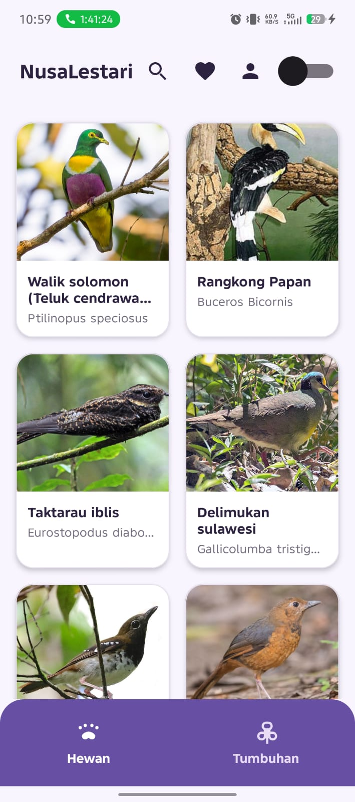
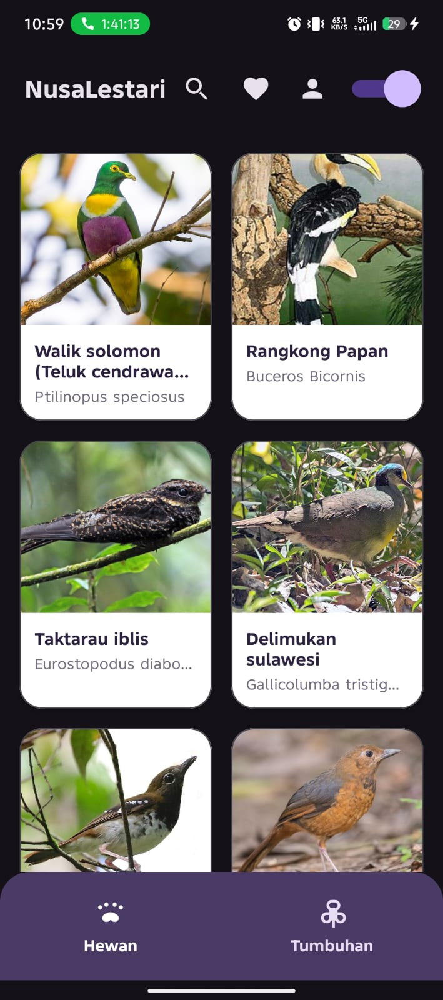
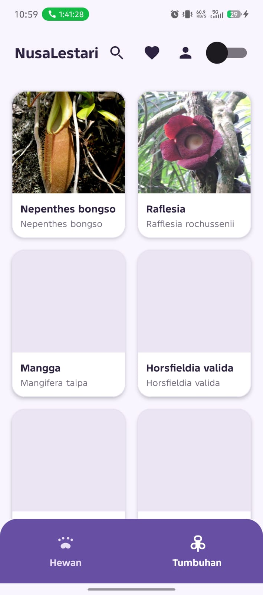
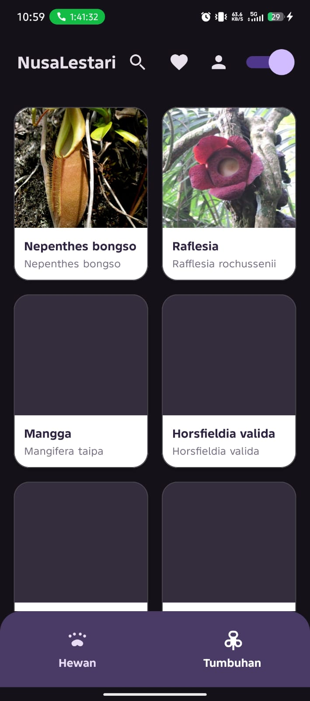
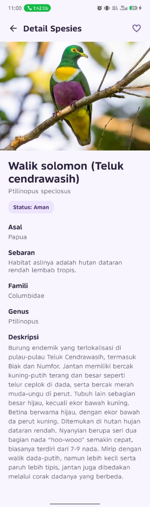
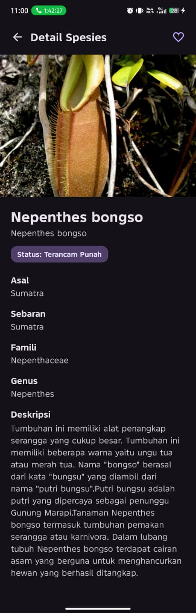
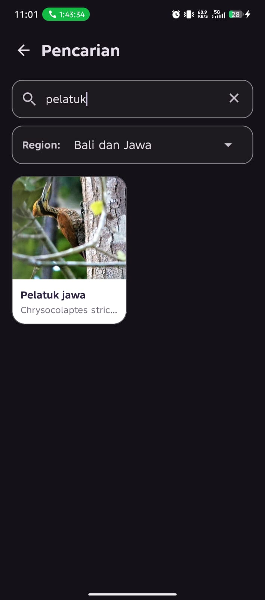
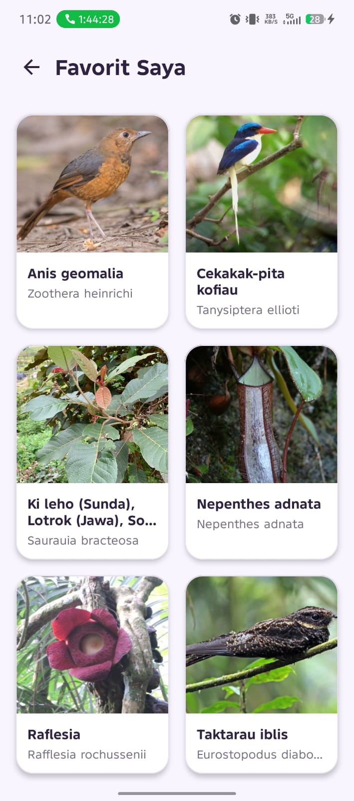
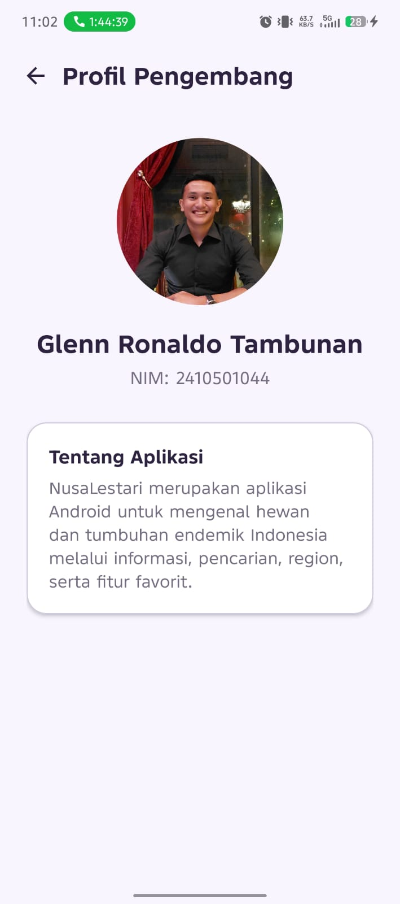
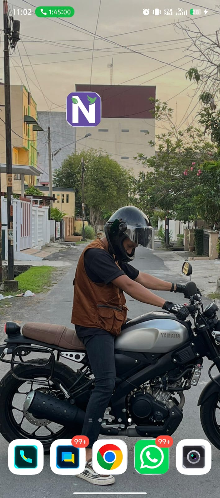

# NusaLestari

NusaLestari adalah aplikasi Android untuk mengenal hewan dan tumbuhan endemik Indonesia. Aplikasi menampilkan informasi spesies berdasarkan kategori hewan dan tumbuhan, dilengkapi pencarian, filter region, favorit, serta mode terang dan gelap.

## Fitur Utama

* Menampilkan data hewan endemik Indonesia
* Menampilkan data tumbuhan endemik Indonesia
* Mengambil data dari API GitHub dan menyimpannya ke Room Database
* Halaman detail spesies
* Pencarian berdasarkan nama spesies atau nama latin
* Filter region berdasarkan asal dan sebaran spesies
* Menambahkan dan menghapus data favorit
* Mode light dan dark
* Halaman profil pengembang

## Teknologi yang Digunakan

* Android Studio
* Java
* XML Layout
* Retrofit dan Gson
* Room Database
* RecyclerView
* Glide
* SharedPreferences

## Sumber Data

Data spesies endemik diperoleh dari:

https://hendroprwk08.github.io/data_endemik/endemik.json 

## Struktur Database

Aplikasi menggunakan dua tabel Room Database:

* "endemik" untuk menyimpan data hewan dan tumbuhan endemik
* "favorit" untuk menyimpan spesies yang dipilih pengguna

## Pengembang

**Nama:** Glenn Ronaldo Tambunan
**NIM:** 2410501044

## Cara Menjalankan Aplikasi

1. Clone atau download repository ini.
2. Buka project menggunakan Android Studio.
3. Tunggu proses Gradle Sync selesai.
4. Hubungkan perangkat Android atau jalankan emulator.
5. Jalankan aplikasi.
6. Pastikan perangkat memiliki koneksi internet saat pertama kali membuka aplikasi agar data dapat diambil dan disimpan ke Room Database.

## Tampilan Aplikasi

### Splash Screen

### Home Hewan — Light Mode

### Home Hewan — Dark Mode

### Home Tumbuhan — Light Mode

### Home Tumbuhan — Dark Mode

### Detail Spesies Hewan

### Detail Spesies Tumbuhan

### Pencarian dan Filter Region

### Favorit

### Profil Pengembang

### Ikon Aplikasi

